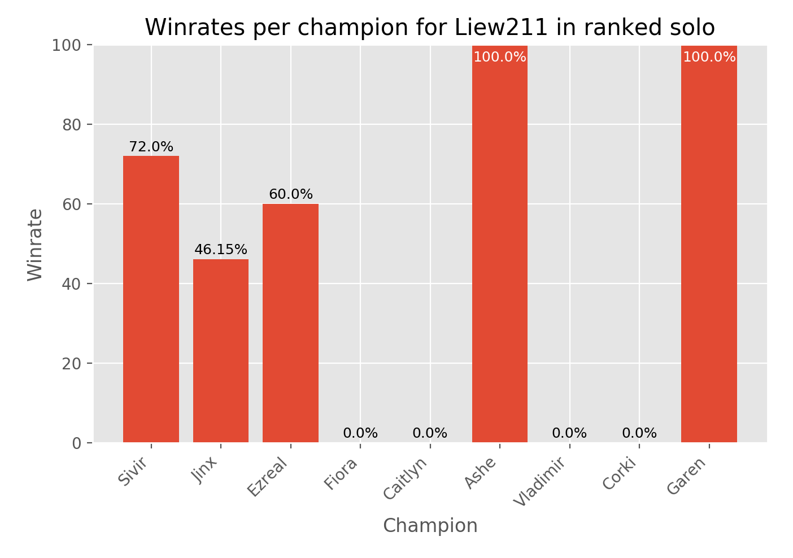

# lolwinrates

[](https://www.python.org/downloads/release/python-374/)

**lolwinrates** calculates and displays your winrate in League of Legends games by using Python with Matplotlib to access the [Riot Games API](https://developer.riotgames.com). The API can be accessed by signing in with your League of Legends account, where you can get your 24-hour developer API key.

To use this program, first install dependencies:
```
pip install -r requirements.txt
```

Replace the API key on line 2 of `config.cfg`, then run `run.py`. You'll be prompted to enter the region code, summoner name, and the queue type: "blind", "draft", "solo", or "flex". The script will access your match history, and parse through up to 50 of your past games in that queue, then display your win-loss record and win percentage, then the list of champions you played, sorted by frequency, the winrates of each champion, and number of games played for each champion, and creates a bar graph with champion winrates using Matplotlib.

Sample output:
```
Region? (i.e. NA)
NA
Summoner Name?
liew211
Which queue?
solo
Loading...
26 wins 24 losses
52.00%
Jinx 62.50% 16 games
Vayne 33.33% 12 games
Jhin 50.00% 10 games
Ezreal 50.00% 8 games
Senna 100.00% 2 games
Nautilus 100.00% 1 game
Tristana 0.00% 1 game
Data acquired in 22.95 seconds.
```

