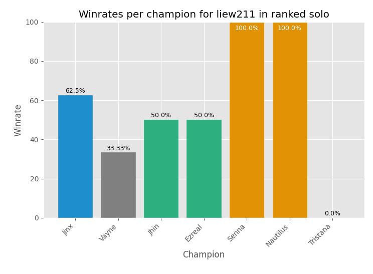

# lolwinrates

[](https://www.python.org/downloads/release/python-374/)

**lolwinrates** calculates and displays your winrate in League of Legends games by using Python with Matplotlib to access the [Riot Games API](https://developer.riotgames.com).  The API can be accessed by signing in with your League of Legends account, where you can get your 24-hour developer API key.

To use this program, replace the API key on line 4 of `api_request.py`, then run `run.py`.  You'll be prompted to enter the summoner name (not case sensitive), and the queue type: "blind", "draft", "solo", or "flex" (also not case sensitive).  The script will access your match history, and parse through up to 50 of your past games in that queue, then display your win-loss record and win percentage, then the list of champions you played, sorted by frequency, the winrates of each champion, and number of games played for each champion, and creates a bar graph with champion winrates using Matplotlib.

Sample output:
```
Summoner Name?
Liew211
Which queue?
Solo
29 wins 21 losses
58.00%
Sivir 72.00% 25 games
Jinx 46.15% 13 games
Ezreal 60.00% 5 games
Fiora 0.00% 2 games
Caitlyn 0.00% 1 game
Ashe 100.00% 1 game
Vladimir 0.00% 1 game
Corki 0.00% 1 game
Garen 100.00% 1 game
```

